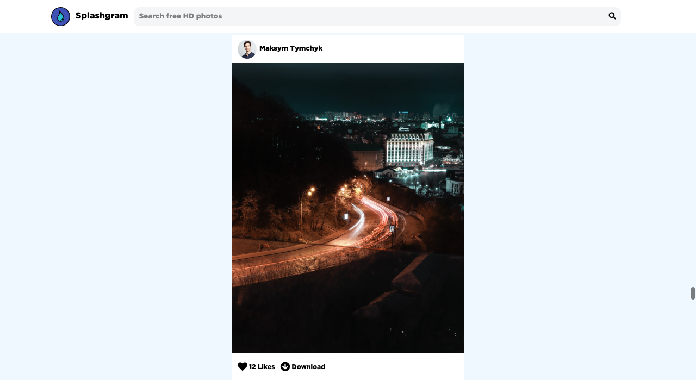
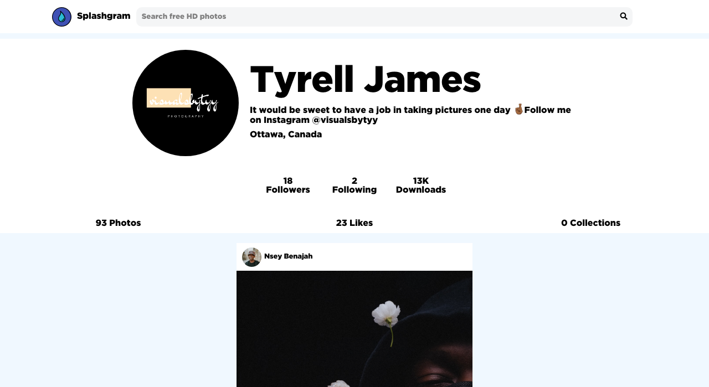

# Splashgram

Splashgram combines the likes of Instagram and Unsplash to deliver a pleasurable high definition photo viewing experience. This web application was built using Node.js, Express.js, Unsplash.js to return data and vanilla JavaScript. Splashgram allows users to search for photos and view a photographer's profile page.

Landing Page
 

Profile Page

